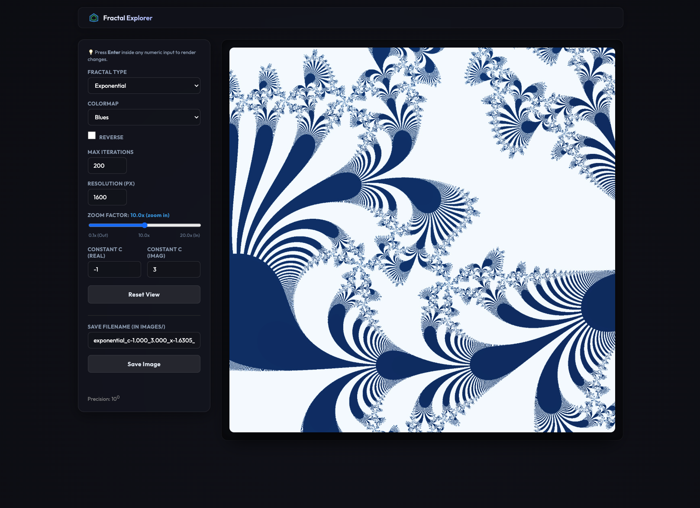
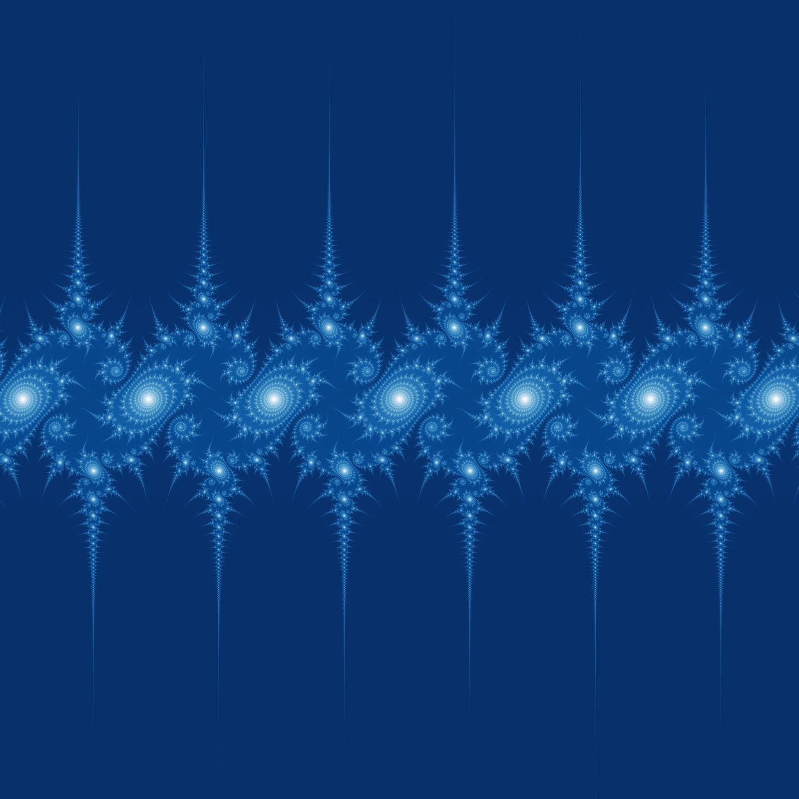
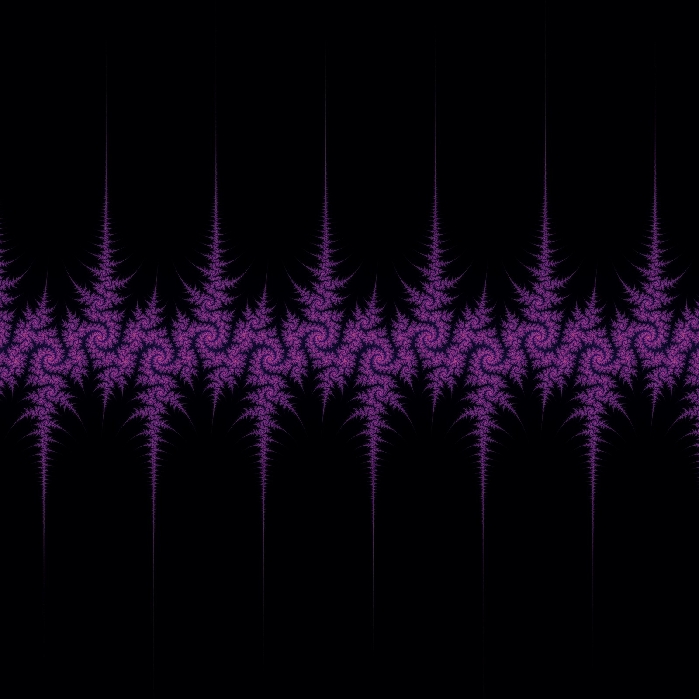

# Fractal MCP Bridge
**An MCP server for scaling fractal computations and rendering images.**

This repository serves as an AI agent backend, connecting the Model Context Protocol (MCP) to a high-performance
Python library for Mandelbrot, Julia, and Exponential sets.

## 🧮 Mathematical Formulas

The computations in this library are based on the following iterative equations in the complex plane:

- **Mandelbrot Set**: $z_{n+1} = z_n^2 + c$
  - Initial condition: $z_0 = 0$
  - $c$ is the coordinate in the complex plane being evaluated.
- **Julia Set**: $z_{n+1} = z_n^2 + c$
  - Initial condition: $z_0$ is the coordinate in the complex plane being evaluated.
  - $c$ is a fixed complex constant for the entire set.
- **Exponential Set**: $z_{n+1} = c \cdot e^{z_n}$
  - Initial condition: $z_0$ is the coordinate in the complex plane being evaluated.
  - $c$ is a fixed complex constant.
- **Sine Set**: $z_{n+1} = c \cdot \sin(z_n)$
- **Cosine Set**: $z_{n+1} = c \cdot \cos(z_n)$
  - Initial condition: $z_0$ is the coordinate in the complex plane being evaluated.
  - $c$ is a fixed complex constant.

## 🏗 Project Architecture
The repository follows a standard Python "src layout" under a unified `fractal_mcp` package. This maintains clear separation between mathematical logic, image processing, and service orchestration:

### 📂 Directory & File Structure
```
fractal-mcp-bridge/
├── .agents/                   # Workspace-scoped AI agent customizations and configurations
│   ├── skills/                # Specialized agent instruction packages and tools
│   ├── AGENTS.md              # Project-specific guidelines, formatting rules, and constraints
│   └── mcp_config.json        # Auto-registration config for MCP servers
├── bin/                       # Executable utility and environment script runners
├── images/                    # Saved output renders and sample fractal images
├── src/
│   └── fractal_mcp/
│       ├── app/               # Interactive Fractal Web Explorer app
│       │   ├── api/           # Endpoint routes for fractal computations
│       │   └── static/        # UI frontend (HTML, CSS, JS assets)
│       ├── bridge/            # FastMCP server exposing tools for agents
│       ├── math/              # Numba-accelerated computational math layers
│       └── renderer.py        # Main rendering engine and color palette coordinator
├── tests/                     # Test suites validating mathematical and service layers
├── pyproject.toml             # Project metadata, script entrypoints, and dependency profiles
└── README.md                  # Core documentation and integration guides
```

## 🌍 Fractal Web Explorer
If you want to interactively explore the Mandelbrot, Julia, and Exponential sets in more detail, you can spin up the encapsulated Fractal Web Explorer.

Once the package is installed, run:
```bash
fractal-web-explorer
```
Open the browser link provided in the terminal (defaults to `http://localhost:8001`).



---

## 🚀 Local Setup & Development
To ensure the environment correctly resolves the internal package mappings, you must perform an editable installation using `pyproject.toml`.

### 1. Prerequisites
- **Python 3.14.1**
- **Node.js / npx** (required for the MCP Inspector)

### 2. Installation
From the repository root, run the following command to map the internal modules to your Python environment and install the core dependencies:
```bash
pip install -e .
```

If you plan to run unit tests, linting, or type checking, install the development dependencies as well:
```bash
pip install -e ".[dev]"
```

### 3. Smoke Testing
You can manually verify the bridge and Numba-accelerated logic using the MCP Inspector:
```bash
npx @modelcontextprotocol/inspector fractal-mcp
```
Open the browser link provided by the inspector to test the tools.

### 4. Code Quality & Unit Tests
To ensure high standards for code style, type safety, and correctness, run the unified validation check script from the repository root:
```bash
bin/run-checks
```

The script runs the following checks in order:
1. **🎨 Formatting Check (`ruff format`)**: Verifies that all code in `src/` and `tests/` adheres to the project's formatting guidelines.
2. **🔍 Linting (`ruff check`)**: Analyzes code quality and catches common style bugs, unused imports, or code smells.
3. **📝 Static Type Analysis (`mypy`)**: Validates static type annotations across `src/` and `tests/`.
4. **🧪 Unit Testing (`pytest` + `pytest-cov`)**: Runs the entire test suite with code coverage analysis:
   * **Numba JIT Disabled**: Executes tests with the environment variable `NUMBA_DISABLE_JIT=1`. Disabling the Just-In-Time compiler ensures fast startup during tests and guarantees that `pytest-cov` can collect accurate, line-by-line coverage metrics.
   * **Coverage Reporting**: Generates a terminal summary pointing out any uncovered lines (`--cov-report=term-missing`) and compiles an interactive HTML report to `htmlcov/index.html`.
   * **Pass-Through Arguments**: Supports passing flags directly to pytest (e.g., `bin/run-checks -k test_mandelbrot` or `bin/run-checks -v`).

---

## 🐳 Running with Docker

This repository includes a [Dockerfile](file:///Users/mike.herrera/workspace/fractal-mcp-bridge/Dockerfile) and [.dockerignore](file:///Users/mike.herrera/workspace/fractal-mcp-bridge/.dockerignore) to run both the web explorer and the MCP bridge server in an isolated container.

### 1. Build the Docker Image
To build the image, run the following command from the repository root. This will install all dependencies (including development ones) and run the test suite (`bin/run-checks`) as part of the build step:

```bash
docker build -t fractal-mcp-bridge .
```

### 2. Run the Web Explorer
To run the interactive Fractal Web Explorer inside the container, expose port `8001`:

```bash
docker run -it --rm -p 8001:8001 fractal-mcp-bridge
```
Then open `http://localhost:8001` in your browser.

### 3. Run the MCP Bridge Server
When running the MCP server inside Docker, you must mount the local `images/` directory to `/app/images` inside the container so generated images are persisted to the host.

#### stdio Mode (Standard Client Integration)
To use the Docker image as an MCP stdio server in client configurations (like Claude Desktop or Cursor), specify `docker` as the command and override the entrypoint to the bridge server:

```json
{
  "mcpServers": {
    "fractal-bridge-docker": {
      "command": "docker",
      "args": [
        "run",
        "-i",
        "--rm",
        "-v",
        "/absolute/path/to/fractal-mcp-bridge/images:/app/images",
        "fractal-mcp-bridge",
        "fractal-mcp"
      ]
    }
  }
}
```

#### SSE Mode (Server-Sent Events)
To run the MCP server in SSE mode, mount the images folder, expose port `8080`, define the `PORT=8080` environment variable, and override the command:

```bash
docker run -it --rm \
  -p 8080:8080 \
  -e PORT=8080 \
  -v /absolute/path/to/fractal-mcp-bridge/images:/app/images \
  fractal-mcp-bridge \
  fractal-mcp
```

---

## 🛠️ MCP Bridge Integration & Usage

The `fractal-mcp` server exposes high-performance fractal computation and rendering tools to AI agents using the Model Context Protocol (MCP).

### 1. Client Configurations

#### 🤖 Claude Desktop Integration
To use this bridge in Claude Desktop, add the server in your `claude_desktop_config.json`:
```json
{
  "mcpServers": {
    "fractal-bridge": {
      "command": "fractal-mcp"
    }
  }
}
```
> [!NOTE]
> If Claude Desktop cannot locate the command (common on macOS GUI apps that do not inherit shell `$PATH`), replace `"fractal-mcp"` with the absolute path to the executable (which can be resolved by running `which fractal-mcp` in your terminal).

#### ☁️ Antigravity Integration
This workspace is optimized for AI agents using **Antigravity**. It includes a dedicated [.agents/](.agents) directory containing:
- **[.agents/mcp_config.json](.agents/mcp_config.json)**: Local MCP configuration that automatically discovers and registers the `fractal-bridge` server and its tools in the Antigravity CLI or IDE.
- **[.agents/AGENTS.md](.agents/AGENTS.md)**: Workspace-scoped development guidelines, style preferences, and verification requirements.
- **`skills/`**: Specialized workspace skills (API guidelines, testing protocols, etc.) loaded automatically by agent workflows.

### 2. Execution Modes

* **stdio Transport Mode (Default)**: Ideal for standard MCP client integrations.
  ```bash
  fractal-mcp
  ```
* **SSE (Server-Sent Events) Transport Mode**: Launch the server in SSE mode by specifying a `PORT` environment variable:
  ```bash
  PORT=8000 fractal-mcp
  ```

### 3. Input Constraints & Rules

To avoid validation errors (`ValueError` / `ToolError`), observe the following rules when invoking the tools:
* **Aspect Ratio**: The viewport coordinates must have a **1-to-1 aspect ratio** to prevent image distortion (i.e., `x_max - x_min` must equal `y_max - y_min`).
* **Complex Constant (`c`)**: Pass complex parameters (for Julia, Exponential, Sine, Cosine sets) as a string. Both `i` and `j` are accepted, and spaces are handled automatically (e.g., `"-0.7+0.27015j"`, `"0.285 + 0.01i"`).
* **Resolution**: Must be a positive integer no greater than `12800`.
* **Colormaps**: Must be a valid [Bokeh palette name](https://docs.bokeh.org/en/latest/docs/reference/palettes.html) (case-insensitive). Examples: `"Turbo"`, `"Viridis"`, `"Plasma"`, `"Inferno"`, `"Magma"`, `"Cividis"`, `"Blues"`.

---

## 💻 Sample Commands & Tool Invocation

You can test tools directly from the terminal using the `fastmcp call` utility. This launches the server, runs the specified tool, saves the resulting image to the local `images/` directory, and prints the image metadata to `stdout`.

### 1. List Available Colormaps

**Agent Prompt:**
> "Show me the list of available colormaps" or "What colormaps are supported by the fractal renderer?"

*Alternatively, you can test this tool directly from your terminal using `fastmcp call`:*
```bash
fastmcp call \
  --command "fractal-mcp" \
  --target list_colormaps
```

### 2. Generate a Mandelbrot Fractal
**Agent Prompt:**
> "Generate a Mandelbrot fractal using the Turbo reversed colormap and a max iteration of 800."

*Alternatively, via terminal command:*
```bash
fastmcp call \
  --command "fractal-mcp" \
  --target generate_mandelbrot_image \
  --input-json '{"x_min": -2.0, "x_max": 1.0, "y_min": -1.5, "y_max": 1.5, "resolution": 1600, "colormap": "Turbo", "reverse_colormap": true, "max_iterations": 800}'
```

### 3. Generate a Julia Fractal (Douady's Rabbit)
**Agent Prompt:**
> "Generate Douady's Rabbit using the Turbo colormap and a max iteration of 800."

*Alternatively, via terminal command:*
```bash
fastmcp call \
  --command "fractal-mcp" \
  --target generate_julia_image \
  --input-json '{"x_min": -2.0, "x_max": 2.0, "y_min": -2.0, "y_max": 2.0, "c": "-0.123+0.745j", "resolution": 1600, "colormap": "Turbo", "max_iterations": 800}'
```

### 4. Generate an Exponential Fractal
**Agent Prompt:**
> "Render an exponential fractal with constant c = 1.0+0.0j, bounds from -20.0 to 20.0, resolution 1600, using the Blues reversed colormap."

*Alternatively, via terminal command:*
```bash
fastmcp call \
  --command "fractal-mcp" \
  --target generate_exponential_image \
  --input-json '{"x_min": -20.0, "x_max": 20.0, "y_min": -20.0, "y_max": 20.0, "c": "1.0+0.0j", "resolution": 1600, "colormap": "Blues", "reverse_colormap": true}'
```

### 5. Generate a Sine Fractal
**Agent Prompt:**
> "Render a sine fractal with constant c = 1.0+0.0j, bounds from -10.0 to 10.0, and resolution 1600."

*Alternatively, via terminal command:*
```bash
fastmcp call \
  --command "fractal-mcp" \
  --target generate_sine_image \
  --input-json '{"x_min": -10.0, "x_max": 10.0, "y_min": -10.0, "y_max": 10.0, "c": "1.0+0.0j", "resolution": 1600}'
```

### 6. Generate a Cosine Fractal
**Agent Prompt:**
> "Render a cosine fractal with constant c = 1.0+0.0j, bounds from -10.0 to 10.0, and resolution 1600."

*Alternatively, via terminal command:*
```bash
fastmcp call \
  --command "fractal-mcp" \
  --target generate_cosine_image \
  --input-json '{"x_min": -10.0, "x_max": 10.0, "y_min": -10.0, "y_max": 10.0, "c": "1.0+0.0j", "resolution": 1600}'
```

### 7. Generate a Newton's Method Fractal
**Agent Prompt:**
> "Render a Newton's method fractal with power 3.0, bounds from -2.0 to 2.0, and resolution 1600."

*Alternatively, via terminal command:*
```bash
fastmcp call \
  --command "fractal-mcp" \
  --target generate_newton_image \
  --input-json '{"x_min": -2.0, "x_max": 2.0, "y_min": -2.0, "y_max": 2.0, "power": 3.0, "resolution": 1600}'
```

---

## 🎨 Rendering Gallery

Below are sample renders generated by the library's high-performance mathematical engine:

### 1. Mandelbrot Set (colormap: `Greys` reversed)


### 2. Julia Set - Douady's Rabbit (c = -0.123 + 0.745i, colormap: `YlGnBu`)


### 3. Exponential Set (c = -2.550 + 1.450i, colormap: `Blues` reversed)


### 4. Sine Set (c = -1.000 + 0.190i, colormap: `Blues`)


### 5. Cosine Set (c = -1.000 + 0.809i, colormap: `Magma`)


### 6. Newton's Method Set (power: p = 5.0, colormap: `Greys` reversed)


